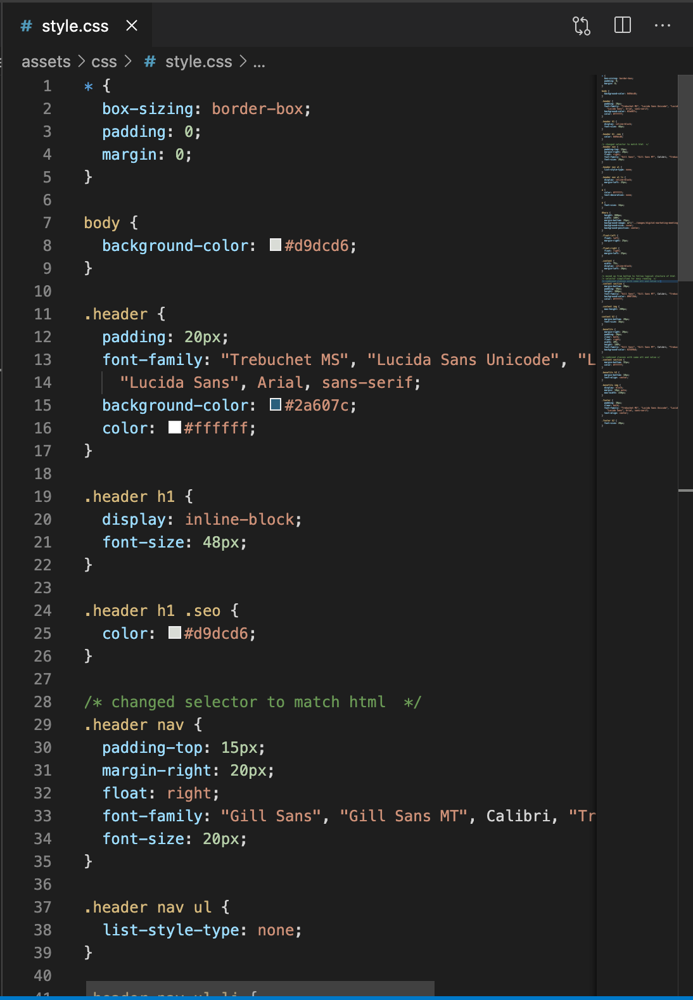

# UW Coding Bootcamp Homework1: Code Refactor

## Task

- improve accessibility and optimize for search engines
- use semantic HTML elements that follow a logical structure
- follow scout rule

## link

http://lk9988.github.io/uw-hw1

## Compare changes

original html

new html

original css

new css

